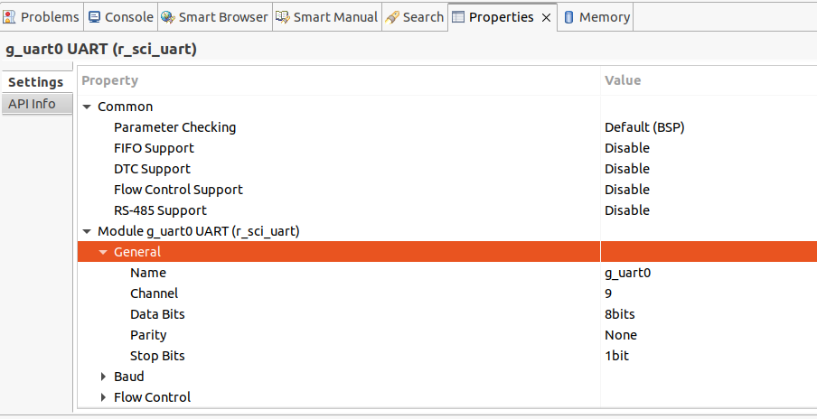

# IoTConnect AT Command Client Interface Code for FreeRTOS
# This repository is currently in proof-of-concept state.

This repository contains code that uses the AT command interface provided by the IoTConnect DA16K SDK to communicate with an Azure IoTConnect environment.

## Official MCU client platform implementations using this library:

* Renesas EK-RA6M4 Evaluation Kit (PMOD connector)
    * Demo project: https://github.com/avnet-iotconnect/iotc-freertos-EK-RA6M4-PMOD
* Renesas CK-RA6M5 v2 Cloud Kit (PMOD connector)
    * Demo project: https://github.com/avnet-iotconnect/iotc-freertos-CK-RA6M5-V2-PMOD

## Setup on a New or Existing Project

### Step 1: Set up Dialog 16200/16600 Device with IoTConnect

Obtain or build the images for your Dialog 16200/16600-based device via the [IoTConnect Dialog 16K SDK repository](https://github.com/avnet-iotconnect/iotc-dialog-da16k-sdk).

**The minimum version of the DA16K IOTCONNECT Firmware is 1.1.0**

Boot and configure it as per the [Quickstart guide](https://github.com/avnet-iotconnect/iotc-dialog-da16k-sdk/blob/main/doc/QUICKSTART.md):

* WiFi connectivity
* X509 certificates
* IoTConnect configuration

### Step 2: Connect target MCU hardware to Dialog 16200/16600

For example: Connecting a DA16K PMOD device to the appropriate port on a Renesas Cloud Kit (e.g. CK-RA6M5)

### Step 3: Add this code to your project

It is portable code that should compile and run out of the box, without any modifications.

## Usage

Using this code is aimed to be as straight-forward as possible:

* Implement UART functionality for your platform

* Configure the library (see **Configuration**)

* Include `da16k_comm.h`

* Call `da16k_init` with a `da16k_cfg` structure.

* Start communicating with IoTConnect by using the `da16k_send_<x>` functions for your appropriate data type.

    These take attribute names (`key`) - as defined in your IoTConnect device template - and an associated value to be sent to IoTConnect.

* Call `da16k_deinit` once you are finished.

## Must-Implement Functions to Integrate Library with New Platform

If you wish to use this code on any platform, it is only necessary to implement a C file with the following basic functions for communicating via UART, declared in `da16k_uart.h`, and link it.

* `da16k_uart_init`

    Initialize the UART interface for your platform. The connection parameters are: **115200bps in an 8-n-1 configuration.**

* `da16k_uart_get_char`

    Receives a character.

    It returns a `da16k_err_t`, `DA16K_SUCCESS` on sucecss or any other concievable value on error
    
* `da16k_uart_write`

    Writes a specified amount of bytes from the buffer into the UART.

    Returns **false** in case of a failure.

* `da16k_uart_close`

    Uninitializes the UART interface for your platform.

## Configuration

The library is configured by setting the following define:

`DA16K_CONFIG_FILE`

By setting this define to a file name (e.g. `-DDA16K_CONFIG_FILE="../da16k_comm_config.h"`), you can configure the library using this file.

An example configuration file is provided (`da16k_config_example`).

## Platform-specific Configuration Parameters

Please refer to [the PLATFORMS document.](./PLATFORMS.md)

### Other Options

* `DA16K_PRINT` - Can be defined to point to a printf-style printing function to override printf or platform specific options (useful for debugging)

* `DA16K_CONFIG_FREERTOS` - Can be defined to automatically use FreeRTOS-style memory allocation.

* `DA16K_CONFIG_MALLOC_FN` - Can be defined to point to a `malloc`-style memory allocation function to override the default `malloc`. This will override any other implied settings (e.g. from `DA16K_CONFIG_FREERTOS`)

* `DA16K_CONFIG_FREE_FN` - Can be defined to point to a `free`-style memory de-allocation function to override the default `free`. This will override any other implied settings (e.g. from `DA16K_CONFIG_FREERTOS`)

# Library Usage (Application Code)

This section describes how to use the library in an application.

The functions generally return descriptive error codes. Please see the `da16k_err_t` enum in `da16k_comm.h` for details.

## Initialization & Device Configuration

To initialize the library, call `da16k_init` and supply a pointer to a `da16k_cfg_t` strcuture.

This structure contains configuration parameters for the library and the AT gateway module.

A comprehensive description for the members can be found in the **IoTConnect configuration/setup** section in `da16k_comm.h`.

* `iotc_config` (optional)

    If this is not NULL, the library will attempt to configure the IoTConnect client on the module to connect using the specified connection, device and environment parameters.

    It can also be used to send a client certificate and key to the gateway for authentication, however:

---

<u>***WARNING:***

***CLIENT CERTIFICATE TRANSMISSION IS INSECURE AND THE FUNCTIONALITY IS ONLY PROVIDED FOR TESTING PURPOSES***</u>

---

* `wifi_config` (optional)

    If this is not NULL, the library will attempt to configure the WiFi-connection on the module to connect to the specified network and credentials.

    If this is NULL, the library expects the module to be provisioned and configured to connect to a network already.
    
* `network_timeout_ms` (optional)

    If this is not 0, this specifies the time to wait for successful completion of latency-dependent activities (i.e. sending telemetry) before flagging a time-out.

    If this is 0, a sensible default value is used.


### `da16k_iotc_cfg_t`

This is a structure for setting IoTConnect connection parameters. Parameters are mostly self-explanatory, except for the device certificates:

If `device_cert` and `device_key` are non-NULL, the library will transmit the certificate / key to the DA16K device so it can be used to authenticate with MQTT.

---

<u>***WARNING:***

***CLIENT CERTIFICATE TRANSMISSION IS INSECURE AND THE FUNCTIONALITY IS ONLY PROVIDED FOR TESTING PURPOSES.*** 

***IN A PRODUCTION ENVIRONMENT, SET `device_cert` and `device_key` TO NULL AND PROVISION THE AT GATEWAY PROPERLY PRIOR TO USING THIS LIBRARY WITH IT.***</u>

---

### `da16k_wifi_cfg_t`

This is a structure for setting WiFi parameters. The Parameters are self-explanatory.

### Manual Configuration Parameter Setup at Runtime

While discouraged, this is possible using the `da16k_set_<x>` functions.

Refer to `da16k_comm.h` for details.

## Sending out Telemetry

Sending out telemetry after the successful initialization is done by serializing (creating) a message (`da16k_msg_t`), sending it and freeing it.

The general principle is as follows:

* Call `da16k_create_msg` to create the message
* Call `da16k_msg_add_*` for the appropriate data type (see below)
* Call `da16k_send_msg` once you are ready to send it out
* Call `da16k_destroy_msg` to dispose of it and free the memory

The following are declared in `da16k_comm.h`.

| Function                      | Parameter     | IoTConnect Type   |
|-------------------------------|---------------|-------------------|
| `da16k_msg_add_str`           | `const char*` | STRING            |
| `da16k_msg_add_bool`          | `bool`        | BOOLEAN           |
| `da16k_msg_add_num`           | `double`      | DECIMAL / INTEGER |

Due to the way that numeric values are handled in the underlying libraries on the module, numeric values are always double precision floating point values.

## Sending out Telemetry Directly (Simplified Direct Create-and-Send)

If your application is simple, single-threaded or otherwise non-critical, you may choose to send the telemetry out directly.

The following functions create the message, send it and dispose of it internally, and directly return a `da16k_err_t` retrun code.

| Function                      | Parameter     | IoTConnect Type   |
|-------------------------------|---------------|-------------------|
| `da16k_send_msg_direct_str`   | `const char*` | STRING            |
| `da16k_send_msg_direct_bool`  | `bool`        | BOOLEAN           |
| `da16k_send_msg_direct_num`   | `double`      | DECIMAL / INTEGER |

## Receiving IoTConnect Cloud to Device Commands

Commands from the cloud are stored on the AT gateway internally on a command queue.

Commands can be retreived from the AT Gateway using `da16k_get_cmd`.

It takes a pointer to a blank `da16k_cmd_t` structure as a parameter and returns a `da16k_err_t`.

In the case of `DA16K_SUCCESS`, the provided structure is filled with the oldest available command.

**The command must be disposed of after usage to avoid memory leaks (see below)**

If no commands have been sent, `DA16K_NO_CMDS` is returned instead.

### Limitations

At this time, commands are acknowledged by the AT gateway automatically, regardless of whether or not they have been fetched by the user, executed successfully or not. This will change in a future version.

### Handling a Received Command (`da16k_cmd_t`).

The structure has two string members, `command` and `parameters`.

Parameters are optional and NULL if none were sent.

After handling the command, the strucutre must be disposed of using `da16k_destroy_cmd`. The structure is given to it as parameter directly, *not* a pointer.

### Example Command Handling

```c
    da16k_cmd_t current_cmd = {0};

    if ((da16k_get_cmd(&current_cmd) == DA16K_SUCCESS) && current_cmd.command) {
        /* do something */
        da16k_destroy_cmd(current_cmd);
    }
```

# Library Integration Example from Scratch: Renesas CK-RA6M5 v2 (e² Studio IDE)

Imagining a scenario with an existing project (e.g. the Quickstart sample project from Renesas, `quickstart_ck_ra6m5_v2_ep`) on the CK-RA6M5 v2 development board, we wish to connect a Dialog 16600 PMOD module to the **PMOD1** connector and communicate with it. 

Proceed as follows.

### Project Configuration

* Open the **Stacks Configuration** window by double clicking on `configuration.xml`.


* Create a new Task using the **New Thread** button. 

    Give the thread a descriptive name, for example `TelemetryGrabber`.

* On the **Stacks** pane, add a new UART by clicking **New Stack**, **Connectivity**, and **UART (r_sci_uart)**


* Using the **Properties** tab, chonfigure the stack to use the UART channel required for the chosen connector. For PMOD1, this is Channel **9**.



* Finish by clicking **Generate Project Content**.


* Add this repository to the `src` directory of the project.


### Implementation

e² studio has generated the necessary files for the new thread. 

* Navigate to `telemetry_grabber_entry.c`, and start adding the necessary code to the `telemetry_grabber_entry` function.

* Call `da16k_init`.

* Extend the task with a loop that aggregates all the telemetry attributes in a fixed time window.

* Whenever the data is aggregated, send the attributes using the appropriate `da16k_send_msg_direct_x` functions.

```c
void telemetry_grabber_entry(void *pvParameters)
{
    FSP_PARAMETER_NOT_USED (pvParameters);

    da16k_cfg_t da16kConfig;

    st_sensor_data_t previousSensorData = {0};
    st_sensor_data_t newSensorData = {0};

    da16k_err_t err = da16k_init(&da16kConfig);

    assert(err == DA16K_SUCCESS);

    while (1)
    {
        /* obtain sensor data */
        sensor_thread_get_status(&newSensorData);

        /* Renesas HS3001 */

        da16k_send_msg_direct_num("hs3001_humidity",    hs300xDataToFloat(&newSensorData.hs300x.hs300x_data.humidity));
        da16k_send_msg_direct_num("hs3001_temperature", hs300xDataToFloat(&newSensorData.hs300x.hs300x_data.temperature));
        (...)
    }
}
```

* You now have a functional project that can send telemetry data to IoTConnect using the Dialog 16K module.

# Limitations

The AT Command Protocol theoretically is able to asynchronously inform the client of changes in connection state, received commands or OTA requests.

Handling these properly asynchronously in a platform-agnostic way is not possible without considerable effort and client specific code.

Since this library focuses on maximum ease of use and ease of implementation, therefore, these functions are not supported.
